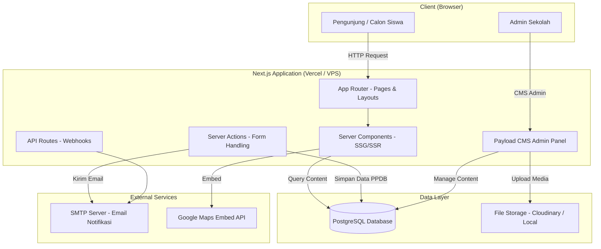

# Design Document: Redesign Website SMK Ma'arif NU 01 Karangkobar

## Overview

Website baru SMK Ma'arif NU 01 Karangkobar dirancang sebagai media informasi utama sekolah yang modern, responsif, dan mencerminkan identitas LP Ma'arif NU. Website ini menggantikan website lama yang memiliki masalah struktural: informasi tidak terorganisir, tampilan tidak mobile-friendly, tidak ada alur PPDB online yang jelas, dan identitas Islam NU kurang menonjol.

### Tujuan Desain

- Menyediakan informasi sekolah yang terstruktur dan mudah ditemukan oleh calon siswa, orang tua, dan masyarakat umum
- Menyediakan alur PPDB online yang jelas dengan formulir pendaftaran digital
- Menampilkan identitas LP Ma'arif NU secara konsisten di seluruh halaman
- Memastikan pengalaman pengguna yang baik di semua perangkat (mobile-first)

### Keputusan Teknologi

**Stack Utama: Next.js 14 (App Router) + TypeScript**

Alasan pemilihan:
- **Next.js App Router** mendukung Server Components untuk performa optimal dan SEO yang baik — penting untuk website sekolah yang perlu diindeks mesin pencari
- **Static Site Generation (SSG)** untuk halaman konten statis (profil, program keahlian, kurikulum) menghasilkan waktu muat yang sangat cepat
- **Server Actions** untuk penanganan formulir PPDB tanpa API route terpisah, menyederhanakan arsitektur
- **TypeScript** memastikan keamanan tipe data, terutama untuk model data formulir PPDB

**Styling: Tailwind CSS + shadcn/ui**

Alasan:
- Tailwind CSS memungkinkan desain responsif yang konsisten dengan utility classes
- shadcn/ui menyediakan komponen aksesibel (ARIA-compliant) yang dapat dikustomisasi sesuai identitas visual NU
- Tidak ada ketergantungan runtime CSS-in-JS yang memperlambat halaman

**Database & CMS: PostgreSQL + Payload CMS (self-hosted)**

Alasan:
- Payload CMS adalah headless CMS berbasis TypeScript yang dapat di-self-host, cocok untuk sekolah yang ingin kontrol penuh atas data
- Admin panel bawaan Payload memungkinkan staf sekolah mengelola konten (berita, galeri, data PPDB) tanpa coding
- PostgreSQL sebagai database relasional yang andal untuk menyimpan data pendaftaran PPDB

**Email: Nodemailer + SMTP Gmail/Zoho**

Alasan:
- Nodemailer adalah solusi pengiriman email yang matang untuk Node.js
- Menggunakan SMTP sekolah atau Gmail untuk notifikasi konfirmasi PPDB
- Tidak memerlukan layanan email berbayar pihak ketiga

**Validasi Formulir: Zod + React Hook Form**

Alasan:
- Zod menyediakan validasi skema yang type-safe, dapat digunakan di client dan server
- React Hook Form meminimalkan re-render dan memberikan UX validasi yang responsif

---

## Architecture

### Arsitektur Sistem



### Pola Rendering

| Halaman | Strategi Rendering | Alasan |
|---|---|---|
| Beranda | ISR (revalidate: 3600) | Konten berubah periodik (berita terbaru) |
| Profil Sekolah | SSG | Konten statis, jarang berubah |
| Program Keahlian | SSG | Konten statis |
| Kurikulum | SSG | Konten statis |
| Sarana & Prasarana | SSG | Konten statis |
| Kesiswaan | ISR (revalidate: 3600) | Prestasi dan berita diperbarui berkala |
| Humas | SSG | Konten statis |
| PPDB | SSR | Formulir dinamis, data real-time |
| Berita/Artikel | ISR (revalidate: 1800) | Konten diperbarui sering |

### Struktur URL

```
/                          → Beranda
/profil                    → Profil Sekolah
/program-keahlian          → Daftar Program Keahlian
/program-keahlian/tbsm     → Detail TBSM
/program-keahlian/tjkt     → Detail TJKT
/program-keahlian/akl      → Detail AKL
/kurikulum                 → Halaman Kurikulum
/sarana-prasarana          → Sarana & Prasarana
/kesiswaan                 → Kesiswaan
/humas                     → Hubungan Masyarakat
/ppdb                      → Informasi & Formulir PPDB
/berita                    → Daftar Berita
/berita/[slug]             → Detail Berita
/galeri                    → Galeri Foto/Video
/404                       → Halaman Not Found
```

---

## Components and Interfaces

### Komponen Layout Global

#### `<Header />`
- Logo sekolah + logo LP Ma'arif NU + logo NU (kiri)
- Menu navigasi utama (desktop: horizontal, mobile: hamburger/drawer)
- Navigasi: Beranda, Profil, Program Keahlian, Kurikulum, Sarana & Prasarana, Kesiswaan, Humas, PPDB
- Sticky header dengan shadow saat di-scroll

#### `<Footer />`
- Kolom 1: Logo + tagline NU + deskripsi singkat sekolah
- Kolom 2: Tautan cepat ke halaman utama
- Kolom 3: Kontak (alamat, telepon, email)
- Kolom 4: Media sosial (Facebook, Instagram, YouTube) + Google Maps mini
- Copyright + identitas LP Ma'arif NU

#### `<Breadcrumb />`
- Ditampilkan di semua halaman kecuali beranda
- Format: `Beranda > [Halaman Saat Ini]` atau `Beranda > [Parent] > [Halaman]`
- Menggunakan schema markup `BreadcrumbList` untuk SEO

#### `<SearchBar />`
- Input pencarian yang dapat diakses dari semua halaman (di header)
- Pencarian full-text terhadap konten berita, program keahlian, dan halaman statis
- Hasil pencarian ditampilkan di halaman `/search?q=...`

### Komponen Halaman Beranda

#### `<HeroSection />`
- Background: foto/video sekolah dengan overlay warna hijau NU
- Judul: "Selamat Datang di SMK Ma'arif NU 01 Karangkobar"
- Tagline: mencerminkan nilai Islam NU
- Dua tombol CTA: "Daftar PPDB Sekarang" dan "Pelajari Program Keahlian"

#### `<InfoCardGrid />`
- 4 card: PPDB, Program Keahlian, Galeri Kegiatan, Mitra Industri
- Setiap card: ikon, judul, deskripsi singkat, tautan

#### `<ProgramKeahlianSection />`
- 3 card program: TBSM, TJKT, AKL
- Setiap card: ikon/foto, nama lengkap, deskripsi singkat, tombol "Selengkapnya"

#### `<GaleriSection />`
- Grid foto kegiatan (minimal 6 foto terbaru)
- Lightbox untuk memperbesar foto
- Tautan ke halaman galeri lengkap

#### `<MitraIndustriSection />`
- Logo atau nama mitra industri dalam format carousel/grid

#### `<EkstrakurikulerSection />`
- Daftar ekstrakurikuler dalam format card atau list

#### `<BeritaTerbaruSection />`
- 3 artikel terbaru: thumbnail, judul, tanggal, ringkasan
- Tautan ke halaman berita lengkap

### Komponen Halaman PPDB

#### `<PPDBInfoSection />`
- Jadwal pendaftaran (tanggal buka–tutup)
- Kuota per program keahlian
- Biaya pendaftaran

#### `<AlurPendaftaran />`
- Stepper visual: langkah 1 → 2 → 3 → dst.
- Setiap langkah: ikon, judul, deskripsi singkat

#### `<PersyaratanDokumen />`
- Daftar dokumen yang harus disiapkan (checklist visual)

#### `<FormPPDB />`
- Formulir multi-step atau single-page dengan validasi real-time
- Field: nama lengkap, NIK, tempat/tanggal lahir, asal sekolah, program keahlian pilihan, nama orang tua, nomor HP, email
- Validasi client-side (Zod + React Hook Form) dan server-side (Server Action)
- Tombol submit dengan loading state
- Tampilan konfirmasi setelah berhasil

### Komponen Umum

#### `<PageHero />`
- Digunakan di semua halaman selain beranda
- Background foto + overlay + judul halaman + breadcrumb

#### `<ArticleCard />`
- Thumbnail, kategori, judul, tanggal, ringkasan, tautan

#### `<GalleryGrid />`
- Masonry atau grid layout untuk foto
- Lightbox dengan navigasi prev/next

#### `<ContactMap />`
- Embed Google Maps iframe
- Informasi kontak di samping peta

---

## Data Models

### Model: `RegistrasiPPDB`

```typescript
interface RegistrasiPPDB {
  id: string;                        // UUID, generated
  nomorPendaftaran: string;          // Format: PPDB-YYYY-XXXXX, generated
  
  // Data Calon Siswa
  namaLengkap: string;               // min 3, max 100 karakter
  nik: string;                       // 16 digit angka
  tempatLahir: string;               // min 2, max 50 karakter
  tanggalLahir: Date;                // max: hari ini - 12 tahun
  jenisKelamin: 'L' | 'P';
  agama: string;                     // Islam, dll.
  alamat: string;                    // min 10, max 255 karakter
  
  // Asal Sekolah
  asalSekolah: string;               // nama SMP/MTs asal
  nisn: string;                      // 10 digit angka
  tahunLulus: number;                // 4 digit tahun
  
  // Pilihan Program
  programKeahlianPilihan1: 'TBSM' | 'TJKT' | 'AKL';
  programKeahlianPilihan2: 'TBSM' | 'TJKT' | 'AKL' | null;
  
  // Data Orang Tua/Wali
  namaOrangTua: string;              // min 3, max 100 karakter
  pekerjaanOrangTua: string;
  nomorHP: string;                   // format: 08xx atau +628xx
  email: string;                     // valid email format
  
  // Metadata
  status: 'pending' | 'verified' | 'accepted' | 'rejected';
  tanggalDaftar: Date;               // auto: created_at
  updatedAt: Date;                   // auto: updated_at
}
```

### Model: `Berita`

```typescript
interface Berita {
  id: string;
  slug: string;                      // URL-friendly, unique
  judul: string;
  ringkasan: string;                 // max 300 karakter
  konten: string;                    // rich text / MDX
  thumbnail: string;                 // URL gambar
  kategori: 'berita' | 'pengumuman' | 'prestasi' | 'kegiatan';
  penulis: string;
  tanggalPublikasi: Date;
  diterbitkan: boolean;
  createdAt: Date;
  updatedAt: Date;
}
```

### Model: `GaleriItem`

```typescript
interface GaleriItem {
  id: string;
  judul: string;
  deskripsi: string | null;
  urlMedia: string;                  // URL foto atau video
  tipeMedia: 'foto' | 'video';
  kategori: string;                  // kegiatan, prestasi, fasilitas, dll.
  tanggal: Date;
  urutan: number;                    // untuk sorting manual
  createdAt: Date;
}
```

### Model: `ProgramKeahlian`

```typescript
interface ProgramKeahlian {
  id: string;
  kode: 'TBSM' | 'TJKT' | 'AKL';
  namaLengkap: string;
  deskripsiSingkat: string;          // max 200 karakter
  deskripsiLengkap: string;          // rich text
  tujuan: string;                    // rich text
  kompetensi: string[];              // daftar kompetensi
  prospekKerja: string[];            // daftar prospek karir
  prestasi: PrestasiItem[];
  foto: string;                      // URL foto utama program
  updatedAt: Date;
}

interface PrestasiItem {
  namaKejuaraan: string;
  tingkat: 'kabupaten' | 'provinsi' | 'nasional' | 'internasional';
  tahun: number;
  keterangan: string | null;
}
```

### Model: `MitraIndustri`

```typescript
interface MitraIndustri {
  id: string;
  namaMitra: string;
  logoUrl: string | null;
  bidangUsaha: string;
  kotaDomisili: string;
  hasMOU: boolean;
  tanggalMOU: Date | null;
  tempatPKL: boolean;
  urutan: number;
}
```

### Skema Validasi Zod untuk FormPPDB

```typescript
import { z } from 'zod';

export const ppdbFormSchema = z.object({
  namaLengkap: z.string().min(3, 'Nama minimal 3 karakter').max(100),
  nik: z.string().length(16, 'NIK harus 16 digit').regex(/^\d+$/, 'NIK hanya boleh angka'),
  tempatLahir: z.string().min(2).max(50),
  tanggalLahir: z.string().refine((val) => {
    const date = new Date(val);
    const minAge = new Date();
    minAge.setFullYear(minAge.getFullYear() - 12);
    return date <= minAge;
  }, 'Usia minimal 12 tahun'),
  jenisKelamin: z.enum(['L', 'P']),
  agama: z.string().min(1),
  alamat: z.string().min(10).max(255),
  asalSekolah: z.string().min(3).max(100),
  nisn: z.string().length(10, 'NISN harus 10 digit').regex(/^\d+$/),
  tahunLulus: z.number().int().min(2020).max(new Date().getFullYear() + 1),
  programKeahlianPilihan1: z.enum(['TBSM', 'TJKT', 'AKL']),
  programKeahlianPilihan2: z.enum(['TBSM', 'TJKT', 'AKL']).nullable().optional(),
  namaOrangTua: z.string().min(3).max(100),
  pekerjaanOrangTua: z.string().min(2),
  nomorHP: z.string().regex(/^(\+62|08)\d{8,11}$/, 'Format nomor HP tidak valid'),
  email: z.string().email('Format email tidak valid'),
});

export type PPDBFormData = z.infer<typeof ppdbFormSchema>;
```

---

## Correctness Properties

*A property is a characteristic or behavior that should hold true across all valid executions of a system — essentially, a formal statement about what the system should do. Properties serve as the bridge between human-readable specifications and machine-verifiable correctness guarantees.*

### Property 1: Validasi formulir PPDB menolak data tidak valid dengan error spesifik

*For any* pengiriman formulir PPDB yang memiliki satu atau lebih field wajib yang kosong atau tidak valid (NIK bukan 16 digit angka, email tidak valid, nomor HP tidak sesuai format, dll.), sistem SHALL menolak pengiriman tersebut dan mengembalikan pesan kesalahan yang spesifik untuk setiap field yang bermasalah, tanpa menghapus data yang sudah diisi dengan benar pada field lainnya.

**Validates: Requirements 8.5**

### Property 2: Data PPDB round-trip — tersimpan dan dapat diambil kembali secara identik

*For any* data pendaftaran PPDB yang valid dan berhasil dikirimkan, data tersebut SHALL dapat diambil kembali dari database dengan semua field yang identik dengan data yang dikirimkan, dan nomor pendaftaran yang dihasilkan untuk setiap pendaftaran SHALL selalu unik (tidak ada duplikat).

**Validates: Requirements 8.4**

### Property 3: Rendering koleksi konten menampilkan semua item dengan field yang diperlukan

*For any* koleksi data konten (foto galeri, mitra industri, ekstrakurikuler, berita, program keahlian, prestasi siswa, langkah pendaftaran), komponen rendering SHALL menampilkan setiap item dalam koleksi tersebut beserta semua field yang dipersyaratkan (nama/judul, deskripsi, tautan, dll.), dan untuk koleksi yang memiliki aturan jumlah minimum (galeri: minimal 6 foto, berita: 3 terbaru), aturan tersebut SHALL selalu terpenuhi.

**Validates: Requirements 1.4, 1.5, 1.6, 1.7, 3.1, 3.2, 3.3, 3.4, 6.2, 8.2**

### Property 4: Responsivitas layout tanpa horizontal overflow pada semua lebar layar

*For any* lebar viewport antara 320px dan 1920px, semua elemen konten utama SHALL tetap dapat dibaca dan tidak ada elemen yang menyebabkan horizontal overflow (scrollWidth > clientWidth) pada body halaman.

**Validates: Requirements 10.1**

### Property 5: Menu navigasi mobile muncul pada semua viewport kecil

*For any* lebar viewport yang kurang dari 768px, hamburger menu atau drawer navigasi SHALL terlihat dan dapat dioperasikan, sementara menu navigasi horizontal desktop SHALL tersembunyi.

**Validates: Requirements 10.2**

### Property 6: Aksesibilitas — semua gambar memiliki atribut alt yang tidak kosong

*For any* halaman website yang dirender, semua elemen `` SHALL memiliki atribut `alt` yang tidak kosong sehingga dapat dibaca oleh teknologi assistif (screen reader).

**Validates: Requirements 10.5**

### Property 7: Navigasi global — breadcrumb dan search bar ada di semua halaman

*For any* halaman website selain beranda, breadcrumb SHALL ditampilkan dengan path yang benar mencerminkan posisi halaman saat ini; dan *for any* halaman website termasuk beranda, search bar SHALL dapat diakses dari header.

**Validates: Requirements 11.2, 11.3**

---

## Error Handling

### Penanganan Error Formulir PPDB

**Client-side (React Hook Form + Zod):**
- Validasi terjadi saat field kehilangan fokus (onBlur) dan saat submit
- Pesan error ditampilkan langsung di bawah field yang bermasalah
- Field yang error diberi border merah dan ikon peringatan
- Data field yang valid tidak dihapus saat ada error di field lain

**Server-side (Server Action):**
- Re-validasi dengan skema Zod yang sama di server (tidak mempercayai data client)
- Jika validasi server gagal, kembalikan `{ success: false, errors: ZodError.flatten() }`
- Jika penyimpanan database gagal, kembalikan pesan error generik dan log error di server
- Jika pengiriman email gagal, tetap kembalikan sukses ke pengguna (pendaftaran tetap tersimpan) dan log kegagalan email untuk retry manual

**Kode Error yang Ditangani:**

| Skenario | Respons ke Pengguna | Aksi Server |
|---|---|---|
| Field wajib kosong | Pesan spesifik per field | Tolak, kembalikan errors |
| Format NIK salah | "NIK harus 16 digit angka" | Tolak |
| Format email salah | "Format email tidak valid" | Tolak |
| Format HP salah | "Format nomor HP tidak valid" | Tolak |
| NIK sudah terdaftar | "NIK ini sudah terdaftar" | Tolak, cek duplikat |
| Database error | "Terjadi kesalahan sistem, coba lagi" | Log error, return 500 |
| Email gagal terkirim | (tidak ditampilkan ke user) | Log untuk retry |

### Penanganan Halaman 404

- Halaman `/not-found.tsx` kustom dengan desain sesuai identitas sekolah
- Menampilkan pesan informatif dalam Bahasa Indonesia
- Tombol "Kembali ke Beranda" dan tautan ke halaman utama
- Tidak menampilkan stack trace atau informasi teknis

### Penanganan Error Umum

- Error boundary di level layout untuk menangkap error rendering yang tidak terduga
- Halaman error kustom (`error.tsx`) dengan tombol "Coba Lagi"
- Semua error server di-log ke console (dapat dikonfigurasi ke layanan monitoring seperti Sentry)

---

## Testing Strategy

### Pendekatan Pengujian

Website ini menggunakan pendekatan pengujian berlapis:

1. **Unit Tests** — Menguji fungsi validasi, utilitas, dan komponen terisolasi
2. **Property-Based Tests** — Menguji properti universal pada logika validasi formulir PPDB
3. **Integration Tests** — Menguji alur formulir PPDB end-to-end (submit → database → email)
4. **Accessibility Tests** — Memverifikasi kepatuhan WCAG 2.1 AA

### Library Pengujian

- **Vitest** — Test runner utama (kompatibel dengan Next.js, cepat)
- **fast-check** — Library property-based testing untuk TypeScript/JavaScript
- **React Testing Library** — Pengujian komponen React
- **Playwright** — End-to-end testing (alur PPDB, navigasi)

### Property-Based Tests (fast-check)

Setiap property test dikonfigurasi dengan minimal **100 iterasi**.

#### Property 1: Validasi formulir PPDB menolak data tidak valid dengan error spesifik
```
Feature: website-redesign, Property 1: Validasi formulir PPDB menolak data tidak valid dengan error spesifik
```
- Generator: objek `PPDBFormData` dengan berbagai kombinasi field tidak valid (field kosong, NIK bukan 16 digit, email tidak valid, HP format salah, dll.) — menggunakan `fc.record` dengan `fc.oneof` untuk menghasilkan variasi tidak valid
- Assertion: `ppdbFormSchema.safeParse(data).success === false`, `errors` berisi key field yang bermasalah, dan field yang valid tidak terpengaruh

#### Property 2: Data PPDB round-trip — tersimpan dan dapat diambil kembali secara identik
```
Feature: website-redesign, Property 2: Data PPDB round-trip — tersimpan dan dapat diambil kembali secara identik
```
- Generator: objek `PPDBFormData` yang valid secara acak (nama acak, NIK 16 digit acak, email valid acak, HP valid acak, dll.)
- Assertion: setelah `saveRegistrasi(data)`, `getRegistrasiById(id)` mengembalikan data yang identik; dan untuk N pendaftaran acak, semua `nomorPendaftaran` adalah unik

#### Property 3: Rendering koleksi konten menampilkan semua item dengan field yang diperlukan
```
Feature: website-redesign, Property 3: Rendering koleksi konten menampilkan semua item dengan field yang diperlukan
```
- Generator: array item konten acak (foto, mitra, berita, dll.) dengan panjang bervariasi
- Assertion: jumlah elemen yang dirender === jumlah item dalam koleksi; setiap elemen memiliki field yang dipersyaratkan; untuk galeri beranda, minimal 6 foto ditampilkan; untuk berita beranda, 3 terbaru ditampilkan

#### Property 4: Responsivitas layout tanpa horizontal overflow pada semua lebar layar
```
Feature: website-redesign, Property 4: Responsivitas layout tanpa horizontal overflow pada semua lebar layar
```
- Generator: integer acak antara 320 dan 1920 (lebar viewport dalam px)
- Assertion: tidak ada elemen dengan `scrollWidth > clientWidth` pada body (tidak ada horizontal overflow)
- Dijalankan dengan Playwright + fast-check

#### Property 5: Menu navigasi mobile muncul pada semua viewport kecil
```
Feature: website-redesign, Property 5: Menu navigasi mobile muncul pada semua viewport kecil
```
- Generator: integer acak antara 320 dan 767 (lebar viewport mobile)
- Assertion: hamburger menu `[data-testid="hamburger-menu"]` visible; menu desktop `[data-testid="desktop-nav"]` hidden

#### Property 6: Aksesibilitas — semua gambar memiliki atribut alt yang tidak kosong
```
Feature: website-redesign, Property 6: Aksesibilitas — semua gambar memiliki atribut alt yang tidak kosong
```
- Generator: array `GaleriItem` acak dengan berbagai judul dan deskripsi
- Assertion: setiap elemen `` yang dirender memiliki atribut `alt` yang tidak kosong (`alt !== ''` dan `alt !== undefined`)

#### Property 7: Navigasi global — breadcrumb dan search bar ada di semua halaman
```
Feature: website-redesign, Property 7: Navigasi global — breadcrumb dan search bar ada di semua halaman
```
- Generator: pilih halaman acak dari daftar semua route yang terdefinisi
- Assertion: untuk halaman selain beranda, `[data-testid="breadcrumb"]` ada dan menampilkan path yang benar; untuk semua halaman, `[data-testid="search-bar"]` ada di header

### Unit Tests

- Fungsi `generateNomorPendaftaran()` — format dan keunikan
- Fungsi `formatTanggal()` — format tanggal Bahasa Indonesia
- Komponen `<FormPPDB />` — render, interaksi, pesan error
- Komponen `<Breadcrumb />` — path yang benar untuk setiap halaman
- Komponen `<AlurPendaftaran />` — render semua langkah

### Integration Tests

- Alur submit formulir PPDB: input valid → Server Action → database tersimpan → email terkirim
- Alur submit formulir PPDB: input tidak valid → error ditampilkan → data valid tidak hilang
- Halaman 404: URL tidak valid → halaman 404 kustom ditampilkan

### Accessibility Tests

- Semua gambar memiliki atribut `alt` yang deskriptif (diverifikasi dengan axe-core)
- Semua form field memiliki label yang terhubung
- Kontras warna memenuhi WCAG 2.1 AA (rasio minimal 4.5:1 untuk teks normal)
- Navigasi keyboard berfungsi di semua komponen interaktif
- Hamburger menu dapat dioperasikan dengan keyboard dan screen reader

> **Catatan**: Validasi aksesibilitas penuh memerlukan pengujian manual dengan teknologi assistif (NVDA, VoiceOver) dan tinjauan ahli aksesibilitas.
